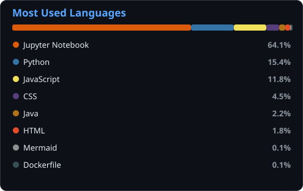

<!-- HEADER / TYPING BANNER -->

<h3><em>“The only real prison is fear, and the only real freedom is freedom from fear.”</em></h3>

---

<!-- ABOUT ME -->
### 🚀 About Me

- 🔭 I'm currently focused on **Backend** and **ML (AI / NLP)**
- 🌱 I'm continuously learning **new technologies and best practices**
- 💬 Ask me about **Python, Java, JavaScript, Django, ML & NLP**
- ⚡ Fun fact: *as a kid I wanted to become a cardiac surgeon* 😄

---

<!-- TECH STACK -->
### 🛠️ Tech Stack

**Languages**

**Frameworks & Libraries**

**Databases**

**Tools & Platforms**

---

<!-- GITHUB STATS DASHBOARD -->
### 📊 GitHub Dashboard

<!-- COMMIT ACTIVITY GRAPH -->
### 📈 Commit Activity

<!-- MOST USED LANGUAGES (self-hosted SVG) -->
### 🧩 Most Used Languages

  

<!-- CONTRIBUTION SNAKE -->
### 🐍 Contribution Snake

<picture>
  <source media="(prefers-color-scheme: dark)" srcset="https://raw.githubusercontent.com/NooruzbekT/NooruzbekT/output/github-snake-dark.svg" />
  <source media="(prefers-color-scheme: light)" srcset="https://raw.githubusercontent.com/NooruzbekT/NooruzbekT/output/github-snake.svg" />
  
</picture>

<!-- TROPHIES -->
### 🏆 Trophies

---

<!-- SOCIALS -->
### 🌐 Connect with Me

  ⭐️ From <a href="https://github.com/NooruzbekT">NooruzbekT</a>

